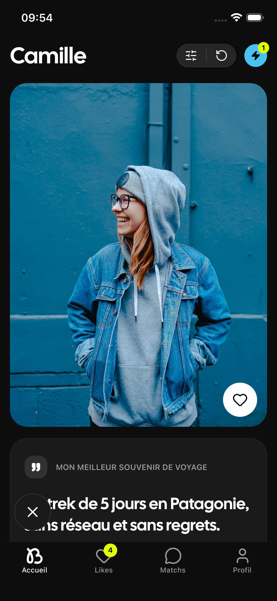
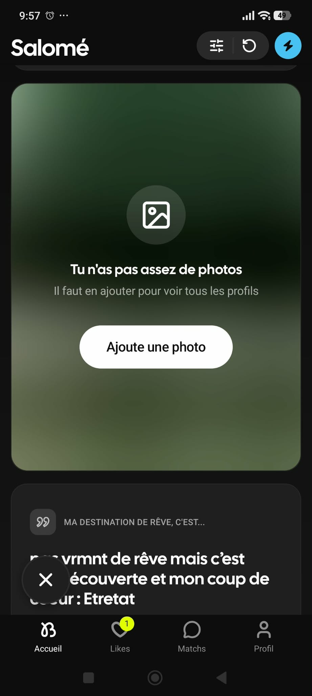
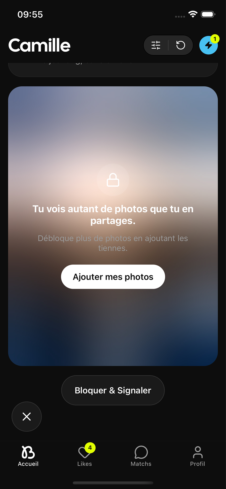
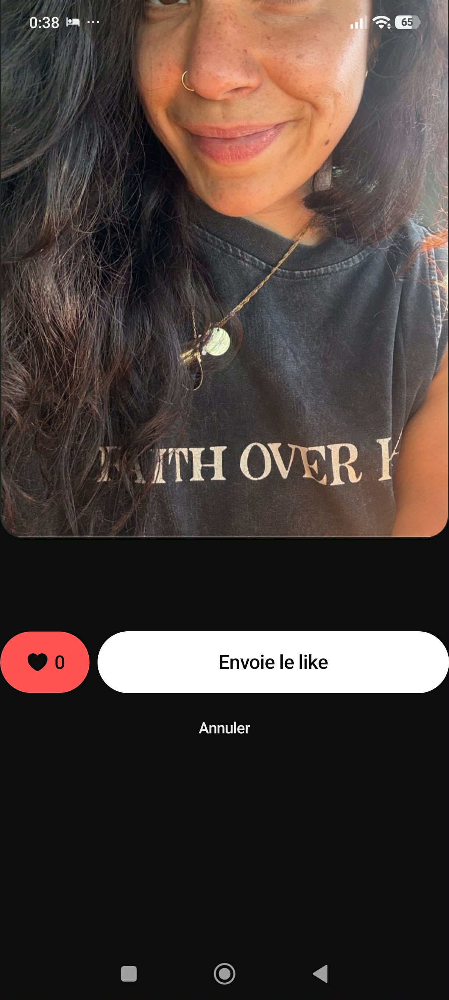
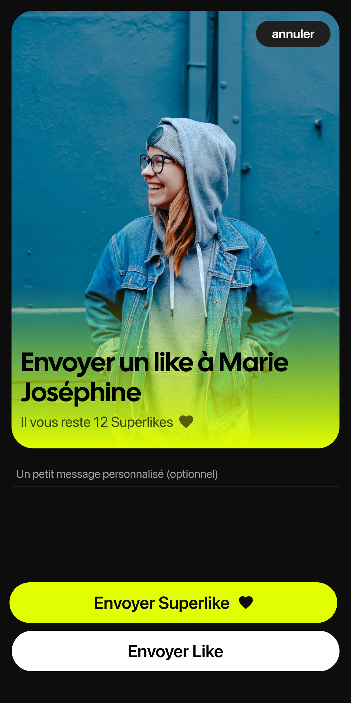
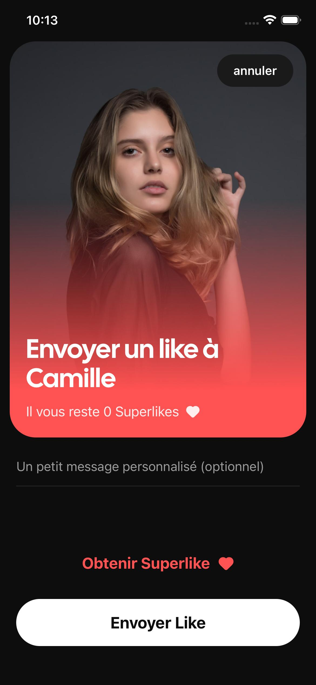
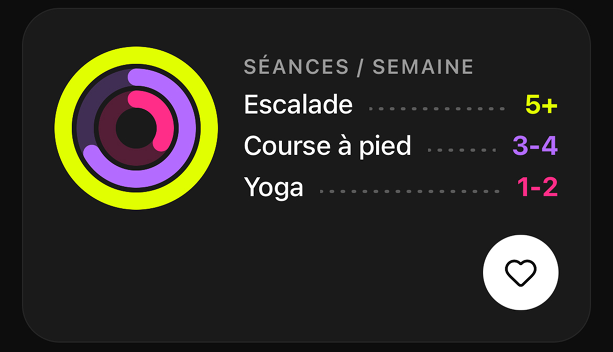

# bpm feed — test technique

Recréation du feed bpm : les profils défilent verticalement carte par carte, on like une carte précise ou on passe le profil entier, et le feed avance.



## Tester l'app

Le plus simple : installer [Expo Go](https://expo.dev/go) (iOS / Android), scanner ce QR code. Rien d'autre à faire.


Lien direct : [ouvrir dans Expo Go](LIEN_EAS_UPDATE_A_COLLER)

Pas de backend : les données viennent d'une fixture locale servie avec ~500 ms de délai simulé — c'est voulu, conforme au brief.

Pour lancer depuis les sources :

```bash
npm install
npx expo start
```

Puis scanner le QR affiché, toujours avec Expo Go (SDK 57, aucun code natif custom). Les checks : `npm run check` (biome + typecheck + vitest + knip).

## Stack

- **Expo Router** — shell à tabs ; les boutons du header et les tabs hors Accueil poussent des pages placeholder
- **TanStack Query** — le feed sort d'une fixture JSON via un mock client ; [api.ts](src/features/feed/api.ts) est la couture prévue pour un vrai backend
- **Zustand** — état client du feed (progression, like/pass)
- **Reanimated** — overlay de réaction like/pass
- **expo-image** (placeholders thumbhash), **react-native-svg** (rings, logo), icônes **lucide**

Le vocabulaire du domaine (Profile, Card, Likable Card, Photo Allowance…) est dans [CONTEXT.md](CONTEXT.md).

## Démarche

Point de départ : le brief, le JSON d'exemple, et le screen que tu m'as laissé sur Notion — je l'ai traité comme un mockup livré par un designer. Je n'ai volontairement pas multiplié les captures du vrai feed bpm : avec Fable 5, le challenge aurait été trop simple.

Tout est fait avec Claude Code (Fable 5) et mes skills perso, en une grosse après-midi de travail. Mon workflow en trois temps :

1. **Grilling** — l'IA m'interviewe (~20 questions, une par une) et toutes les décisions sont figées avant de coder. [Voir la conversation](LIEN_GRILLING_A_COLLER)
2. **to-issues** — le plan est découpé en 11 issues, des tranches verticales livrables dans l'ordre. Elles sont dans [.grilled/issues/](.grilled/issues/) — je les laisse volontairement dans le repo pour que vous puissiez les lire.
3. **implement-next-issue** — une issue = une conversation fraîche = une PR mergée dans `main`, avec `npm run check` à chaque fois. [Voir un exemple](LIEN_IMPLEMENT_A_COLLER)

Une conversation neuve par issue, c'est l'IA qui repart sur une base saine : pas de pollution des issues précédentes, et on reste sous ~250K tokens — au-delà, elle hallucine nettement plus.

Les deux premières issues posent le socle : Expo / Expo Go et les ressources (icônes, iOS, Android), puis le tooling — biome (formatage), knip (code mort), vitest (tests sur la logique pure uniquement).

La page d'envoi de like est arrivée dans un second temps. J'ai d'abord dessiné mes mockups sur Figma (les deux états : superlikes restants ou épuisés), puis une session **grill-the-interface** pour trancher toutes les questions d'UI avant de coder — ça a donné les 4 dernières issues. [Voir la conversation](LIEN_INTERFACE_A_COLLER)

## Deux divergences assumées

### 1. La carte « photos verrouillées »

| Original bpm | Ma version |
|---|---|
|  |  |

Le message original m'a vraiment fait hésiter : « Tu n'as pas assez de photos » en plein milieu du profil de quelqu'un d'autre, avec un bouton pour ajouter *mes* photos. La règle est bonne — on voit autant de photos qu'on en partage — mais le wording la cache. Je l'ai reformulée pour l'expliquer : « Tu vois autant de photos que tu en partages. »

### 2. La page d'envoi de like

| Original bpm | Superlikes restants | Plus de superlikes |
|---|---|---|
|  |  |  |

La page originale me semble perfectible, j'ai donc proposé autre chose. Deux états pensés dès le mockup : s'il reste des superlikes, le CTA Superlike est mis en avant ; sinon, la page devient un point d'entrée pour en obtenir. Un champ de message personnalisé accompagne le like dans les deux cas.

## Choix et libertés

- **Bouton restart** sur le feed vide — affordance de démo, rejoue le même feed.
- **Labels français inventés** pour les types de relation : casual = « Fractionné — À fond, puis on souffle », intimate = « Sprint — Intense, sans détour ». Exclusive (« Endurance ») reprend le wording réel de l'app.
- **Icônes** : lucide partout ; le glyphe de citation bpm est remplacé par `Quote` (rempli) — assets originaux indisponibles.
- **Couleurs à la pipette** (approximatives) pour celles hors palette du brief : `accentPurple`, `accentPink`, gris des panneaux.
- **Rings sport** : remplissage proportionnel à la fréquence d'entraînement (1-2 → 1/3, 3-4 → 2/3, 5+ → plein) — règle inventée.

  

- **Photo Allowance** appliquée côté client avec `VIEWER_UPLOADED_PHOTOS_COUNT = 3`. Elle ne se déclenche jamais sur la fixture (2 photos max par profil) — couverte par les tests unitaires ; passer la constante à 1 pour la voir en live.
- **Ratio photo fixe ~3:4.**
- **Contrôles inertes** : « Bloquer & Signaler » et « Ajouter mes photos » ne font rien ; boutons du header et tabs hors Accueil mènent à des pages placeholder.
- **Badges statiques** : Likes (4) et Boost (1) — les likes entrants ne sont pas modélisés.
- **Pas de persistance** : l'état du feed vit en mémoire ; pas de fausses mutations like/pass.
- **Enums sûrement pas exhaustifs** — les types sont déduits du seul JSON d'exemple.
- **Champs du JSON non affichés** : `sportIcon`, la `trainingFrequency` globale de la carte sport, la `category` des prompts et les champs cachés d'`info_card` — le mockup ne les montre pas.
- **Cal Sans** récupérée sur Google Fonts et embarquée dans le projet ; réservée aux titres.
- **Logo bpm refait à la main en SVG** pour la tab bar — pas parfait, mais il fait le taff.

## Et avec plus de temps ?

- **Brancher un vrai backend** — [api.ts](src/features/feed/api.ts) est la couture : remplacer le mock client par de vraies requêtes, ajouter les mutations like/pass.
- **Persister** l'état du feed — aujourd'hui tout est en mémoire.
- **Durcir les types** — les enums méritent un vrai contrat d'API plutôt qu'une déduction depuis un JSON d'exemple.
